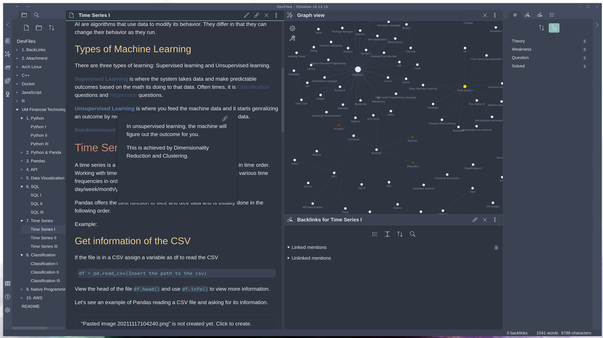

#####  https://obsidian.md/



# My Notes 

## Notes Method 

### File-System Hierarchy

1.Back-links[](https://help.obsidian.md/How+to/Working+with+backlinks):
	- Contains all back-links from every home directory 
	
2.Attachment: 
	- Holds all attachment

Parent folder: 
	- Contains sub-directories of the differ modules taught in that class 
	- Directory Named after the class the information was learned in
	
Sub-directories: 
	- Contains files for x amount_of_days in class
	- Files are named after the main topic of that lesson
	- Files contain information specific to that lesson 
			

### Tagging  
Tags[](https://help.obsidian.md/How+to/Working+with+tags) (```#```): 
	#Theory 
		- Theoretical Hypothesis
	#Question 
		- Questions about the subject at hand 
	#Solved 
		- Solution to inquires made in the question tag
	#Weakness

### External-links
Back-links with web-sites (```[](input_link)```):
	Pre-requisites:
		- Links with information about thing you had to know before taking course

### Forums
Forums (```[](input_forum_link)```):
	Pre-requisites:
		- Links with forums that helped you answer questions

### Back-links
Back-links (```[[input_link]]```): 
	New Concept:
		- New concepts introduced during that lecture


### Audio Recording
Audio recordings (```ctrl/cmd+p: Audio Recording: Start Recording```)
	Record any TAG-related topics:
		- Ensure the tag is placed beside it 
		- 

	

